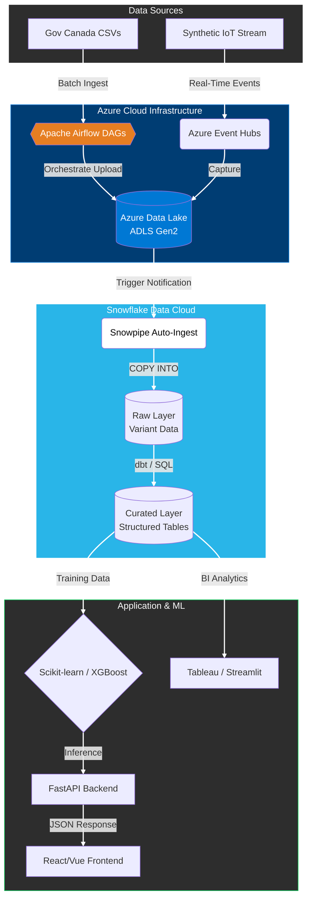

# Cloud-Native Fuel Efficiency Platform (Azure & Snowflake)

## 📌 Project Overview
This repository hosts a production-grade **Cloud Data Engineering Platform** designed to process large-scale government fuel datasets. It extends the Canadian EnerGuide system by replacing static CSV analysis with a scalable **ETL Pipeline** on Azure.

The system orchestrates data movement from **Azure Data Lake Storage (ADLS Gen2)** into **Snowflake** using **Snowpipe** for near real-time ingestion, enabling downstream ML models to forecast carbon tax impacts.

### 🟢 Live Demo
**[[Launch Forecasting Dashboard](https://dashboard-5p9c.onrender.com/)](https://forecasting-fuel-efficiency-4.onrender.com/)]]**

---

## 🏗️ Enterprise Data Architecture
The pipeline follows a **Modern Data Stack** pattern, leveraging Azure for scalable storage and Snowflake for decoupled compute.

## Key Features

* **Vehicle Search and Comparison** – Compare **fuel efficiency, emissions, and annual fuel costs** across models.
* **Interactive Dashboards** – Visualize **historical and forecasted trends** in fuel economy, emissions, and costs.
* **Predictive Analytics** – Machine learning models (e.g., **Scikit-learn, XGBoost**) estimate **fuel consumption and carbon tax impacts**.
* **Policy Insights** – Provide **projections for government agencies** to refine emissions policies.
* **Manufacturer Insights** – Identify **inefficient vehicle models** for compliance improvements.
* **Personalized Recommendations** – Suggest **cost-effective and eco-friendly vehicles** to consumers.

---

## Architecture

* **Data Ingestion** – Government datasets (CSV) + **synthetic streaming events** via **Kafka on Azure Event Hubs**.
* **Data Orchestration** – Automated ETL with **Apache Airflow DAGs** for ingestion, validation, and transformation.
* **Data Storage** – Raw and curated data stored in **Azure Data Lake Storage (ADLS Gen2)**.
* **Data Warehouse** – Processed datasets loaded into **Snowflake**, with **Snowpipe** for near real-time ingestion.
* **Visualization** – **Tableau** and **Streamlit dashboards** connected to Snowflake for interactive analytics.
* **Frontend** – User-facing dashboard built with **React/Vue.js**.

---

## Tech Stack

* **Backend**: Python, FastAPI
* **Machine Learning**: Scikit-learn, XGBoost, Random Forest, Decision Trees
* **Data Engineering**: Pandas, NumPy, **Apache Airflow**
* **Streaming**: **Kafka on Azure Event Hubs** (simulated ingestion)
* **Data Warehouse**: **Snowflake**
* **Visualization**: **Tableau, Streamlit, Matplotlib, Seaborn**
* **Frontend**: React or Vue.js
* **Deployment**: Render (demo hosting), **Azure (pipeline services)**

---

## Project Goals

* Improve **consumer awareness** of fuel costs and carbon tax.
* Enable **data-driven decision-making** for vehicle purchases.
* Provide **government agencies** with insights for emissions policies.
* Help **manufacturers** meet sustainability targets.

---

## Future Enhancements

* Integrate **real-time API/IoT data feeds**.
* Deploy predictive models as **APIs with Azure ML**.
* Expand coverage beyond Canada.
* Add **Power BI dashboards** for enterprise analytics.
